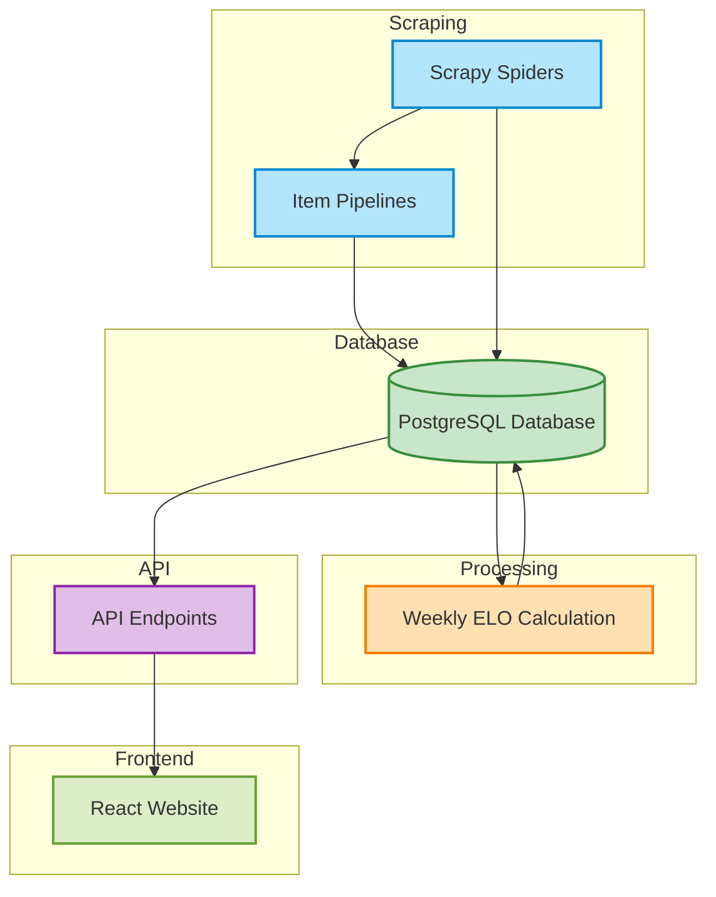

# MMA ELO Engine

## Introduction
The MMA ELO Engine is a powerful tool designed to answer the age-old question: "Who is the best fighter?" In the world of mixed martial arts (MMA), rankings can often be subjective and hotly debated. Our project leverages the ELO rating system, traditionally used in chess, to objectively evaluate fighters' performance based on head-to-head contests. By scraping data from various MMA organizations, we calculate ELO scores that provide a quantifiable measure of a fighter's skill level. This engine not only aids in ranking fighters but also fuels discussions about their abilities, making the conversation about "the best" more data-driven and insightful.

## Understanding ELO Ratings

#### What is ELO?

ELO is a rating system used to calculate the relative skill levels of players in two-player games such as chess, and more recently, in combat sports like MMA. It provides a dynamic way to rank competitors based on their performance against one another.

#### Origins of ELO

The ELO rating system was developed by Arpad Elo, a Hungarian-American physics professor, in the 1960s. Initially designed for chess, it aimed to provide a more accurate reflection of player skill compared to the previously used systems. The ELO system quickly gained popularity and has since been adapted for various sports and games, including boxing and mixed martial arts (MMA).

#### Mathematical Definition

The ELO rating system calculates a player’s new rating based on the following formula:

$$
R_{new} = R + k (S - E_{S})
$$

Where:

- $R_{new} :=$ New rating
- $R :=$ Current rating
- $k :=$ Development coefficient (a constant that determines how much a player's rating can change after each match)
- $S :=$ Actual score (1 for a win, 0 for a loss, and 0.5 for a draw)
- $E_{S} :=$ Expected score, calculated using the following formula:

$$
E_{S} = \frac{1}{1 + 10^{(R_{opponent} - R) / 400}}
$$

- $R_{opponent}:=$ Rating of the opponent

#### Intuitive Understanding

To understand ELO intuitively, think of it as a way to gauge a player's skill relative to their opponents. When a player wins against a higher-rated opponent, their rating increases significantly because it indicates a strong performance. Conversely, if a lower-rated player loses to a higher-rated one, their rating decreases less dramatically. This dynamic system allows for quick adjustments based on recent performances, providing a more accurate representation of skill over time.

For example, if Fighter A (rated 1600) beats Fighter B (rated 1400), Fighter A’s rating will increase significantly, while Fighter B’s will decrease, reflecting the outcome of the match.

#### Why is ELO Useful?

ELO ratings offer several benefits:

1. **Dynamic and Reflective**: The ratings adjust based on recent performances, making them a current and relevant measure of skill.

2. **Comparative Ranking**: ELO allows for easy comparison between fighters or players, making it easier for fans and organizations to assess matchups.

3. **Encourages Competition**: The system encourages players to compete against others with similar ratings, promoting fairer and more exciting matches.

4. **Widely Recognized**: The ELO system is well-known and respected across various sports, making it a trusted measure for fans, analysts, and fighters alike.

By incorporating ELO ratings into your MMA database, you provide users with a powerful tool to evaluate fighters' performances and skill levels, enhancing the overall experience of interacting with your data.

## Data Flow Diagram

## Technical Overview

### Design Philosophy
The MMA ELO Engine was designed with the following principles in mind:
- **Data-Driven Insights**: By utilizing a proven statistical framework, our project aims to provide an objective ranking system that transcends subjective opinions.
- **Modularity and Scalability**: The architecture allows for easy addition of new data sources and methods for calculating ELO scores, ensuring that the engine can adapt to changes in the MMA landscape.

### Technology Stack
- **Database**: PostgreSQL is used to store fighter data, fight results, and calculated ELO scores, ensuring data integrity and efficient querying.
- **Web Scraping**: We utilize Python libraries like Beautiful Soup and Scrapy to gather statistics from multiple MMA organizations, enabling comprehensive data collection.
- **API Development**: FastAPI is employed to create a robust and high-performance API, allowing users to access fighter statistics and ELO scores programmatically.
- **Data Processing**: Custom algorithms are implemented to calculate ELO scores based on fight outcomes, adjusting ratings according to the opponents' ranks.

### Architecture
The project is structured in a modular fashion:
1. **Data Collection**: A web scraper fetches and stores fighter statistics and fight results in the database.
2. **ELO Calculation**: An ELO calculation module processes fight results and updates fighter ratings accordingly.
3. **API Layer**: The FastAPI application serves as an interface for users to query fighters and their ELO scores, facilitating easy access to data.

### Unique Features
What sets the MMA ELO Engine apart from existing UFC/MMA ELO projects:
- **Dynamic Data Sources**: Our system integrates data from various MMA promotions, providing a more comprehensive view of a fighter's performance.
- **Real-Time Updates**: As fights occur, the engine automatically updates fighter ratings, ensuring that users always have access to the most current data.
- **User-Friendly API**: The FastAPI interface allows developers and enthusiasts to easily access and integrate the ELO data into their applications or analyses.

## Data Flow

The data flow in this project can be summarized as follows:

1. **Scraping**: The backend utilizes Scrapy to scrape data from various MMA-related websites. The data collected includes information about fighters, fights, and events.

2. **Processing**: After the data is scraped, it is processed and cleaned to ensure it adheres to the required schema.

3. **Storing**: The processed data is then stored in a PostgreSQL database named `mma_elo_db`, which consists of the following tables:
   - **Fighters**: Contains information about each fighter.
   - **Fights**: Records details about each fight, including the fighters involved and the result.
   - **Events**: Details about the events where the fights take place.

4. **API Interaction**: The backend exposes API endpoints that allow users to query the database and retrieve information about fighters, fights, and events. Users can perform actions such as:
   - Fetching fighter statistics.
   - Retrieving fight history.
   - Accessing event details.

## Conclusion
The MMA ELO Engine is not just a ranking system; it’s a step towards a more analytical approach to understanding fighter performance in mixed martial arts. By combining the ELO rating system with modern data collection and API technologies, this project aims to bring clarity to the conversation about who truly deserves the title of "the best fighter."
