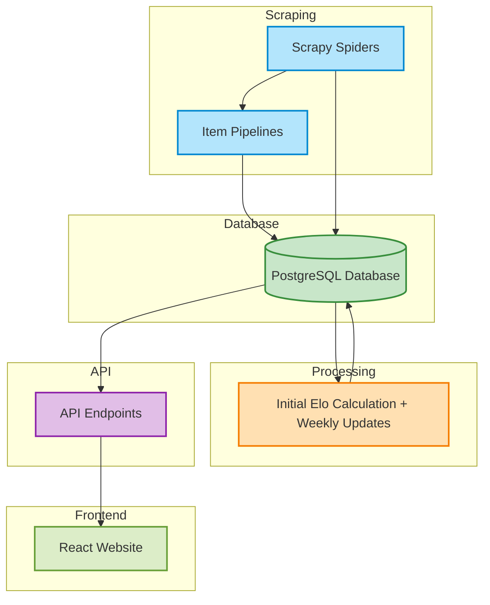

# MMA Elo Engine

#### Updates
[10/10/2024]
- Only supports UFC fights as of now.
- Scraping is working (Scrapy).
- Data is updated and stored in PostgreSQL database (locally as of now).
- Elo engine is working.
- Upated schema to have a separate table for Elo history.
- Created functions in database for quicker access to fighter Elo history.
- Currently working on implementing the backend in Rust.

## Introduction
The MMA Elo Engine is a tool designed to help answer the age-old question: "Who is the best fighter?" In the world of mixed martial arts (MMA), rankings can often be subjective and hotly debated. This project leverages the Elo rating system, traditionally used in chess, to evaluate fighters' performance based on head-to-head contests. By scraping data from various MMA organizations, we calculate Elo scores that provide a quantifiable measure of a fighter's skill level. This engine aids in ranking fighters and also fuels discussions about their abilities, making the conversation about "the best" more data-driven and insightful. This engine also utilizes fast methods in scraping, storing, and processing data that scale well, providing an effective framework to build off of for Elo ranking systems for other competitive endeavors such as tennis, BJJ, 1v1 esports, fencing, etc.

## Understanding Elo Ratings

#### What is Elo?

Elo is a rating system used to calculate the relative skill levels of players in two-player games such as chess, and in some cases, in combat sports like MMA. It provides a way to rank competitors based on their performance against one another.

#### Mathematical Definition

The Elo rating system calculates a player’s new rating based on the following formula:

$$
R_{new} = R_{current} + k (S - E_{S})
$$

Where:

- $R_{new} :=$ New rating
- $R_{current} :=$ Current rating
- $k :=$ DevElopment coefficient (a constant that determines how much a player's rating can change after each match)
- $S :=$ Actual score (1 for a win, 0 for a loss, and 0.5 for a draw)
- $E_{S} :=$ Expected score, calculated using the following formula:

$$
E_{S} = \frac{1}{1 + 10^{(R_{opponent} - R_{current}) / 400}}
$$

- $R_{opponent}:=$ Rating of the opponent

#### Intuitive Understanding

To understand Elo intuitively, think of it as a way to gauge a player's skill relative to their opponents. When a player wins against a higher-rated opponent, their rating increases significantly because it indicates a strong performance. Conversely, if a lower-rated player loses to a higher-rated one, their rating decreases less dramatically.

For example, if Fighter A (rated 1400) beats Fighter B (rated 1600), Fighter A’s rating will increase significantly, while Fighter B’s will decrease significantly. However if Fighter B were to beat Fighter A, then their ELOs would change, but less dramatically since this is result is closer to the estimated expected outcome.

## Data Flow Diagram

## Technical Overview

### Technology Stack
- **Database**: PostgreSQL is used to store fighter data, fight results, and calculated Elo scores.
- **Web Scraping**: We utilize the fast Python scraping framework Scrapy to gather statistics.
- **API Development**: FastAPI is employed to create a high-performance API.

### Architecture
The project is structured in a modular fashion:
1. **Data Collection**: A web scraper fetches and stores fighter statistics and fight results in the database.
2. **Elo Calculation**: An Elo calculation module processes fight results and updates fighter ratings accordingly.
3. **API Layer**: The FastAPI application serves as an interface for users to query fighters and their Elo scores, facilitating easy access to data.

### Goals / Future Features
- **Dynamic Data Sources**: Integrate data from various MMA promotions, providing a more comprehensive view of a fighter's performance.
- **Real-Time Updates**: As fights occur, automatically update fighter ratings, ensuring that users always have access to the most current data.

## Data Flow

The data flow in this project can be summarized as follows:

1. **Scraping**: The backend utilizes Scrapy to scrape data from various MMA-related websites. The data collected includes information about fighters, fights, events, and initializes Elo ratings for each fighter to 1000.

2. **Processing**: After the data is scraped, it is processed and cleaned to ensure it adheres to the required schema through the Item Pipeline in Scrapy.

3. **Storing**: The processed data is then stored in a PostgreSQL database named `mma_elo_db`, which consists of the following tables:
   - **`fighters`**: Contains information about each fighter.
   - **`fights`**: Records details about each fight, including the fighters involved and the result.
   - **`events`**: Details about the events where the fights take place.
   - **`elo_records`**: Elo history for each fighter.

4. **API Interaction**: The backend exposes API endpoints that allow users to query the database and retrieve information about fighters, fights, events, and elo ratings. Users can perform actions such as:
   - Fetching fighter statistics.
   - Retrieving fight history.
   - Retrieving Elo history.
   - Accessing event details.

## References
### Inspired by:
[UFC-Elo-Engine](https://github.com/NBAtrev/UFC-Elo-Engine) created by Trevor Hicks.
